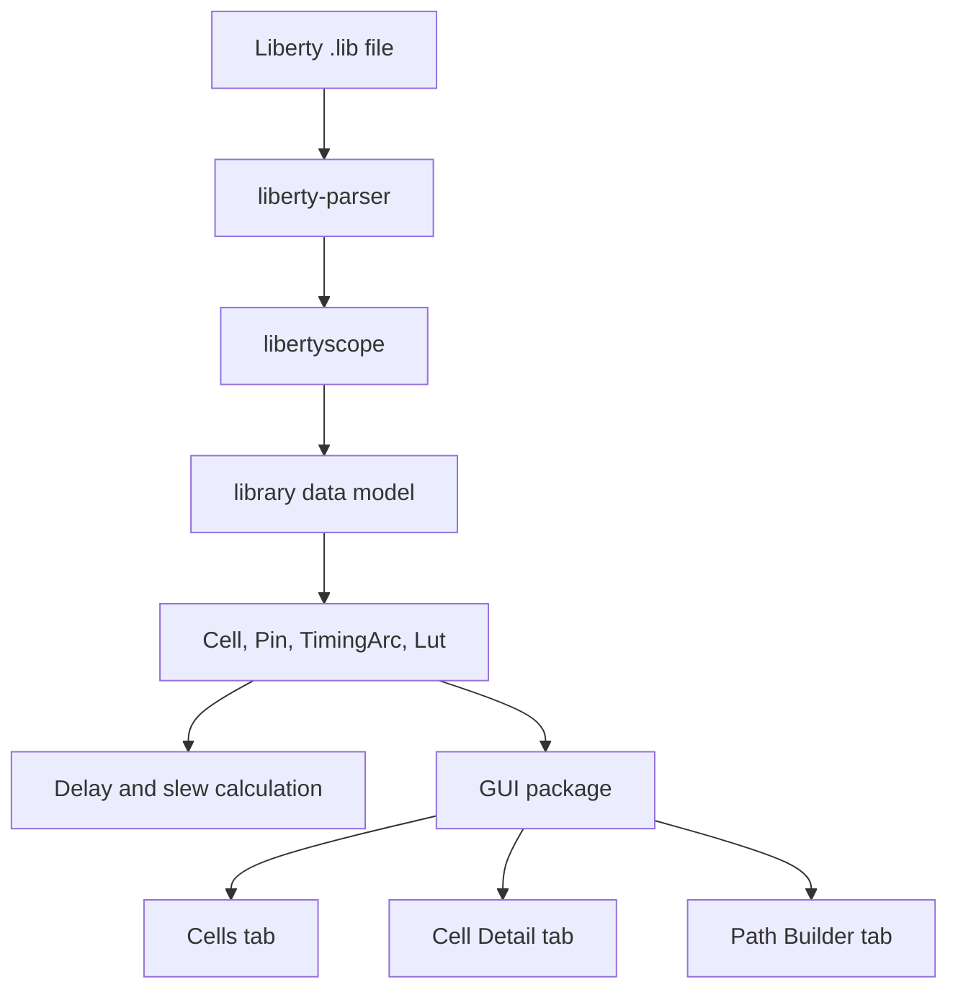
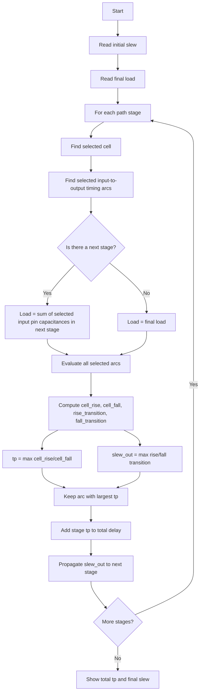

# LibertyScope

LibertyScope is a Python-based tool for inspecting Liberty (`.lib`) standard-cell libraries and computing cell propagation delay and output slew from NLDM lookup tables. The project includes a graphical interface for browsing cells, checking timing arcs, computing individual cells, and building simple timing paths.

The current version keeps the parsing and calculation layers separated from the GUI. The GUI is now a Python package, divided into multiple files by responsibility, and the Path Builder supports stages with more than one selected input pin.

---

## Main Features

- Load and inspect Liberty `.lib` files.
- Browse standard cells, input pins, output pins, pin capacitances, and timing arcs.
- Inspect timing tables associated with each propagation arc:
  - `cell_rise`
  - `cell_fall`
  - `rise_transition`
  - `fall_transition`
- Compute propagation delay (`tp`) and output slew for a selected cell.
- Perform bilinear interpolation over NLDM lookup tables.
- Clamp out-of-range slew/load values to the nearest LUT boundary.
- Build a timing path through multiple cells.
- Propagate output slew from one stage to the next.
- Estimate the load of each stage from the input capacitance of the following stage.
- Select multiple input pins in one Path Builder stage and keep the worst local timing arc.
- Run the GUI either as a module or through a launcher script.

---

## Requirements

- Python 3.10 or newer
- `liberty-parser`
- Tkinter, usually included with standard Python installations

Install the parser dependency with:

```bash
pip install liberty-parser==0.0.29
```

On some Linux distributions, Tkinter may need to be installed separately. For example:

```bash
sudo apt install python3-tk
```

---

## How to Run

From the project root directory:

```bash
python -m gui
```

Alternatively:

```bash
python run_gui.py
```

You can also run the basic test script:

```bash
python test.py
```

The test script loads `NangateOpenCellLibrary_typical.lib`, computes delay/slew for selected cells, and prints a simple path delay example.

---

## Project Structure

```text
IEEE/
├── NangateOpenCellLibrary_typical.lib
├── test.py
├── run_gui.py
├── readme.md
├── README_CAMBIOS.md
│
├── gui/
│   ├── __init__.py
│   ├── __main__.py
│   ├── main.py
│   ├── app.py
│   ├── cells_tab.py
│   ├── detail_tab.py
│   └── path_tab.py
│
├── libertyscope/
│   ├── __init__.py
│   └── explorer.py
│
└── library/
    ├── __init__.py
    ├── library.py
    └── cells/
        ├── __init__.py
        ├── cells.py
        └── cell/
            ├── __init__.py
            ├── cell.py
            ├── pin.py
            ├── timingArc.py
            ├── lut.py
            └── utils.py
```

---

## Architecture Overview

The project is organized into three main layers.



### 1. `libertyscope/`: parser wrapper

This layer wraps the tree generated by `liberty-parser` and provides helper methods to navigate Liberty groups and attributes.

Main file:

```text
libertyscope/explorer.py
```

Main responsibilities:

- Load a Liberty file.
- Navigate Liberty groups such as `library`, `cell`, `pin`, and `timing`.
- Read attributes from Liberty groups.
- Provide a cleaner interface over the raw parser output.

Example:

```python
from libertyscope import load_liberty

lib = load_liberty("NangateOpenCellLibrary_typical.lib")
cell = lib.find("cell", "INV_X1")
pin = cell.find("pin", "ZN")
```

This layer does not compute timing values. It only exposes parsed data.

---

### 2. `library/`: semantic model and timing engine

This layer converts the parsed Liberty data into Python objects that represent the library, cells, pins, timing arcs, and lookup tables.

Main files:

```text
library/library.py
library/cells/cells.py
library/cells/cell/cell.py
library/cells/cell/pin.py
library/cells/cell/timingArc.py
library/cells/cell/lut.py
library/cells/cell/utils.py
```

Main responsibilities:

- Store global library metadata.
- Build a list of standard cells.
- Extract input and output pins.
- Extract propagation timing arcs.
- Store NLDM lookup tables.
- Compute timing values using LUT interpolation.

---

### 3. `gui/`: graphical user interface package

The GUI is now a package instead of a single monolithic `gui.py` file.

Main files:

```text
gui/app.py
gui/cells_tab.py
gui/detail_tab.py
gui/path_tab.py
gui/main.py
gui/__main__.py
```

Main responsibilities:

- Load Liberty files through a graphical menu.
- Display all cells in a table.
- Display detailed information about a selected cell.
- Compute individual cell delay and slew.
- Build and evaluate simple paths through multiple cells.
- Allow multiple input pins per Path Builder stage.

The GUI can be launched with:

```bash
python -m gui
```

because the package includes `gui/__main__.py`.

---

## Main Classes

### `Library`

Defined in:

```text
library/library.py
```

Represents the complete Liberty file.

Important attributes:

| Attribute | Meaning |
|---|---|
| `name` | Library name |
| `delay_model` | Liberty delay model, usually `table_lookup` |
| `time_unit` | Time unit used by the library |
| `cap_load_unit` | Capacitive load unit |
| `nom_voltage` | Nominal voltage |
| `nom_temperature` | Nominal temperature |
| `cells` | Container of parsed standard cells |

---

### `Cell`

Defined in:

```text
library/cells/cell/cell.py
```

Represents one standard cell.

Important attributes:

| Attribute | Meaning |
|---|---|
| `name` | Cell name |
| `area` | Cell area |
| `input_pins` | Dictionary of input pins |
| `output_pins` | Dictionary of output pins |
| `timing_arcs` | List of propagation timing arcs |
| `tp` | Worst propagation delay after computation |
| `slew_out` | Worst output slew after computation |
| `worst_arc` | Timing arc that produced the largest delay |

Important method:

```python
cell.compute(input_slew, output_load)
```

This computes:

- `cell_rise`
- `cell_fall`
- `rise_transition`
- `fall_transition`
- `tp = max(cell_rise, cell_fall)`
- `slew_out = max(rise_transition, fall_transition)`

For a full cell computation, all propagation arcs of the cell are evaluated and the slowest one is kept.

---

### `Pin`

Defined in:

```text
library/cells/cell/pin.py
```

Represents a Liberty pin.

Important attributes:

| Attribute | Meaning |
|---|---|
| `name` | Pin name |
| `direction` | Pin direction, such as `input` or `output` |
| `capacitance` | Input capacitance, when available |
| `timing_arcs` | Timing arcs associated with output pins |

---

### `TimingArc`

Defined in:

```text
library/cells/cell/timingArc.py
```

Represents a timing relationship from one input pin to one output pin.

Important attributes:

| Attribute | Meaning |
|---|---|
| `related_pin` | Input pin that activates the timing arc |
| `output_pin` | Output pin affected by the arc |
| `timing_sense` | Timing sense, such as `positive_unate`, `negative_unate`, or `non_unate` |
| `timing_type` | Timing type, such as combinational, rising edge, or falling edge |
| `luts` | Dictionary of the four NLDM lookup tables |

Important methods:

```python
arc.is_propagation()
arc.compute(input_slew, output_load)
```

Only propagation arcs with all four required LUTs are used for delay/slew calculations.

---

### `Lut`

Defined in:

```text
library/cells/cell/lut.py
```

Represents a 2D NLDM lookup table.

Important attributes:

| Attribute | Meaning |
|---|---|
| `name` | LUT name, such as `cell_rise` |
| `template` | Liberty LUT template name |
| `index_1` | Input slew axis |
| `index_2` | Output load axis |
| `values` | Table values |

Important methods:

```python
lut.lookup(input_slew, output_load)
lut.lookup_1d(output_load, input_slew=None)
```

The main lookup method uses bilinear interpolation.

---

## Timing Calculation Model

Each timing arc is evaluated using two inputs:

```text
input_slew
output_load
```

These two values are used to interpolate each of the four LUTs:

```text
cell_rise
cell_fall
rise_transition
fall_transition
```

For one timing arc:

```text
tp = max(cell_rise, cell_fall)
slew_out = max(rise_transition, fall_transition)
```

For one complete cell calculation:

```text
all propagation arcs are evaluated
worst_arc = arc with the largest tp
cell.tp = worst_arc.tp
cell.slew_out = worst_arc.slew_out
```

---

## Bilinear Interpolation

The `Lut.lookup()` method performs bilinear interpolation over the Liberty table axes.

The first axis is the input slew axis:

```text
index_1
```

The second axis is the output load axis:

```text
index_2
```

The algorithm:

1. Clamp `input_slew` and `output_load` if they are outside the LUT range.
2. Find the two surrounding points in the input slew axis.
3. Find the two surrounding points in the output load axis.
4. Read the four neighboring table values.
5. Interpolate between those four values.
6. Return the interpolated result and metadata about clamping and bounds.

Conceptually:

```text
                output_load
                  y0    y1
input_slew x0    q00   q01
           x1    q10   q11
```

The returned value is interpolated between `q00`, `q01`, `q10`, and `q11`.

---

## GUI Tabs

### Cells Tab

Implemented in:

```text
gui/cells_tab.py
```

This tab shows a table of standard cells. It includes information such as:

- Cell name
- Area
- Number of input pins
- Number of output pins
- Number of timing arcs
- Total input capacitance

Selecting a cell updates the Cell Detail tab.

---

### Cell Detail Tab

Implemented in:

```text
gui/detail_tab.py
```

This tab shows detailed information for the selected cell:

- General cell data
- Input and output pins
- Pin capacitances
- Timing arcs
- Timing sense
- Timing type
- Individual cell computation fields

It also allows computing a selected cell using a user-provided input slew and output load.

---

### Path Builder Tab

Implemented in:

```text
gui/path_tab.py
```

This tab allows building a cell chain and estimating the accumulated path delay.

For each stage, the user selects:

- Cell
- One or more input pins
- Output pin

Multiple input pins can be selected using Ctrl or Shift.

---

## Path Builder Calculation

The Path Builder computes the total path delay stage by stage.



For a stage with one input pin, the stage evaluates only one timing arc:

```text
A1 -> ZN
```

For a stage with multiple selected input pins, all corresponding arcs are evaluated:

```text
A1 -> ZN
A2 -> ZN
B1 -> ZN
```

The stage keeps the worst local arc:

```text
stage_tp = max(tp(A1 -> ZN), tp(A2 -> ZN), tp(B1 -> ZN))
```

The output slew associated with the worst local arc becomes the input slew of the next stage.

The total path delay is:

```text
total_tp = stage_1_tp + stage_2_tp + stage_3_tp + ...
```

---

## Load Calculation in the Path Builder

For every stage except the last one, the output load is estimated from the next stage.

If the next stage has one selected input pin:

```text
output_load = capacitance(next_input_pin)
```

If the next stage has multiple selected input pins:

```text
output_load = sum(capacitance(pin) for pin in next_selected_input_pins)
```

For the last stage, the user-provided final load is used:

```text
output_load = final_load
```

This makes the Path Builder conservative and allows one output to be modeled as driving multiple selected inputs in the next stage.

---

## Basic Usage from Python

```python
from library.library import Library

lib = Library("NangateOpenCellLibrary_typical.lib")
cell = lib.findCell("INV_X1")

result = cell.compute(input_slew=0.05, output_load=10.0)

print(result["tp"])
print(result["slew_out"])
print(result["arc"])
```

Example of a simple chain:

```python
from library.library import Library

lib = Library("NangateOpenCellLibrary_typical.lib")

inv = lib.findCell("INV_X1")
and2 = lib.findCell("AND2_X1")
dff = lib.findCell("DFF_X1")

inv.compute(input_slew=0.04, output_load=and2.input_pins["A1"].capacitance)
and2.compute(input_slew=inv.slew_out, output_load=dff.input_pins["CK"].capacitance)
dff.compute(input_slew=and2.slew_out, output_load=0.0)

total_delay = inv.tp + and2.tp + dff.tp
print(total_delay)
```

---

## Recent Code Changes

The latest refactor focused on two goals:

1. Convert the GUI into a Python package.
2. Allow the Path Builder to evaluate more than one input pin per stage.

### GUI refactor

Before the refactor, the GUI lived in a single `gui.py` file. It is now organized as:

```text
gui/
├── __init__.py
├── __main__.py
├── main.py
├── app.py
├── cells_tab.py
├── detail_tab.py
└── path_tab.py
```

The old monolithic `gui.py` file was removed to avoid a name conflict with the new `gui/` package.

### New launchers

The project can now be launched with:

```bash
python -m gui
```

or:

```bash
python run_gui.py
```

### Multiple input pins in Path Builder

The Path Builder now stores selected input pins as a list:

```python
{
    "cell": cell_name,
    "input_pins": input_pins,
    "output_pin": output_pin,
}
```

For compatibility with the previous single-pin format, the helper `_stage_input_pins()` accepts both:

```python
"input_pins"
```

and:

```python
"input_pin"
```

### Files intentionally not modified

The following packages were intentionally left unchanged:

```text
libertyscope/
library/
```

The requested changes could be implemented from the GUI layer, so the parser wrapper and calculation engine were preserved.

---

## Validation Performed

The refactored code was checked with Python compilation:

```bash
python3 -m compileall -q .
```

The GUI package import was also checked:

```bash
python3 - <<'PY'
from gui import LibertyGUI, main
print("gui package import ok")
PY
```

A complete runtime test that loads a Liberty file requires `liberty-parser` to be installed in the environment.

---

## Limitations and Notes

- The current timing calculation is based on NLDM lookup tables.
- The Path Builder is a simplified timing-path estimator, not a complete STA engine.
- It does not perform full graph traversal, reconvergent path analysis, clock analysis, setup/hold checking, or constraint propagation.
- Sequential arcs are only considered when they pass the current propagation-arc filter.
- The GUI assumes that the selected input/output pins correspond to valid timing arcs in the Liberty file.
- Out-of-range LUT queries are clamped to the closest table boundary.
- The worst case for multiple selected input pins is selected locally per stage using the largest `tp`.

---

## Suggested Development Workflow

1. Install dependencies.
2. Run the GUI with `python -m gui`.
3. Open a Liberty `.lib` file.
4. Inspect the Cells tab.
5. Select a cell and check its pins/arcs in the Cell Detail tab.
6. Test individual cell computation.
7. Build a chain in the Path Builder.
8. Select multiple input pins where needed.
9. Compute the chain and inspect total delay and final slew.

For code changes, run:

```bash
python3 -m compileall -q .
```

before packaging or submitting the project.

---

## Summary

LibertyScope provides a compact educational and experimental environment for exploring Liberty files and understanding how standard-cell timing values are obtained from NLDM tables. Its structure separates parsing, timing calculation, and graphical interaction, which makes the project easier to maintain and extend.

The latest version improves maintainability by converting the GUI into a package and improves the Path Builder by supporting multiple input pins per stage with a conservative worst-case selection.
